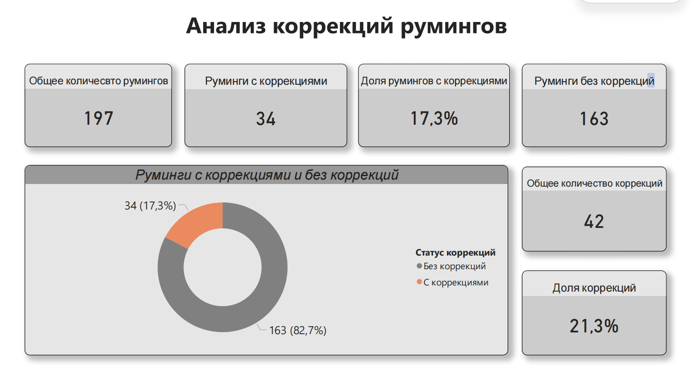
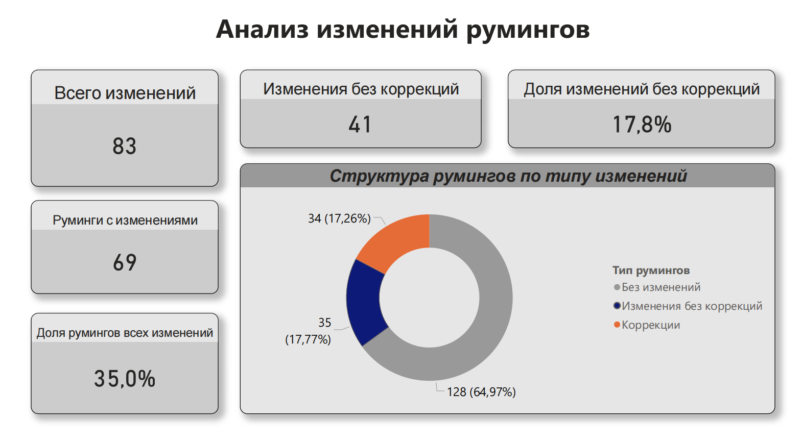
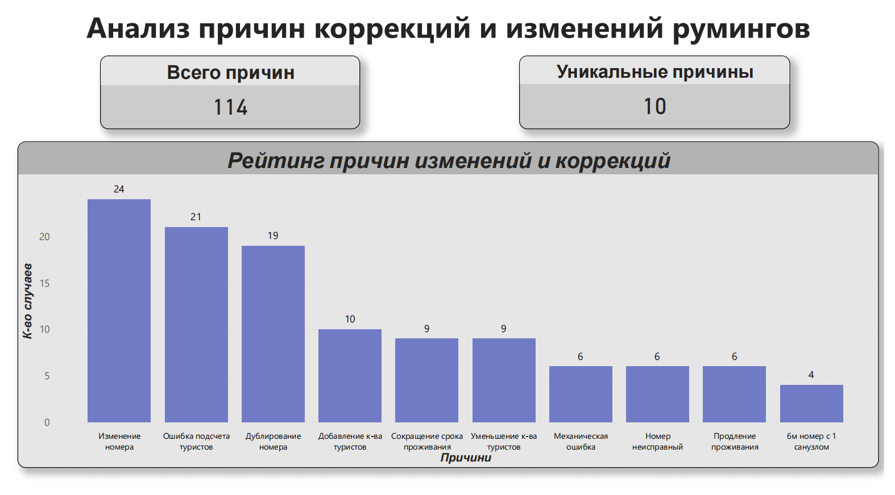
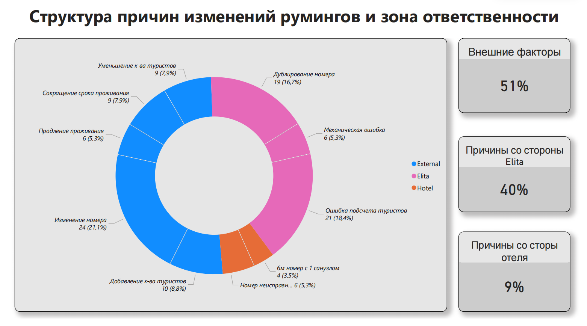
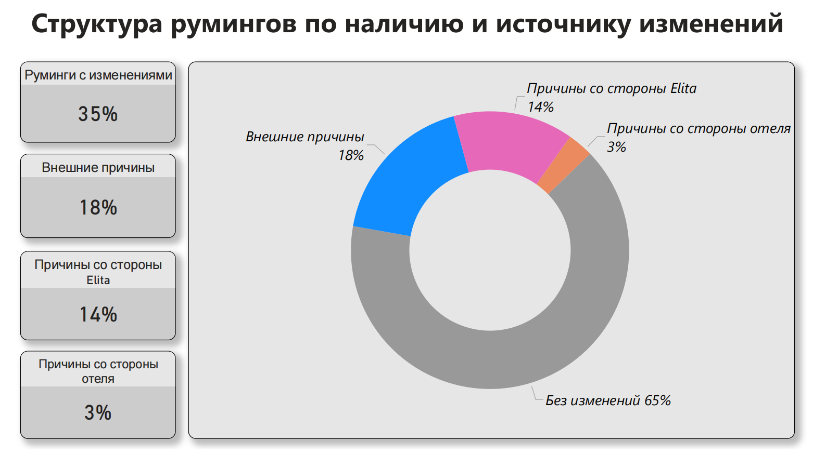

# Rooming Operations Analysis

Power BI project focused on analyzing rooming list changes, corrections, their causes, and areas of responsibility in travel operations.

> **Confidentiality note:** This portfolio version uses anonymized business information and generic labels to protect confidential company data.

> **Language note:** The original dashboard was created in Russian for internal business use. The project description and analysis are presented in English for portfolio purposes.

## Project Overview

This dashboard was created to analyze operational changes in rooming lists, measure how often corrections occurred, identify the main reasons for changes, and understand where operational issues originated.

The report provides a structured management view of corrections, operational changes, root causes, and responsibility areas.

## Business Goal

The goal of this project was to:

- Measure how frequently rooming lists required corrections or other changes
- Identify the most common reasons for operational changes
- Separate external causes from internal operational issues
- Analyze responsibility areas across operational processes
- Provide management with a clear overview of recurring issues
- Support data-driven decisions aimed at improving operational quality

## Tools & Skills

- Power BI
- KPI analysis
- Operational analysis
- Root cause analysis
- Data visualization
- Dashboard design
- Business reporting
- Responsibility analysis
- Data interpretation

## Dashboard Overview

### Page 1 — Corrections Overview

This page provides a general overview of rooming list corrections.

It shows:

- Total number of rooming lists
- Total number of corrections
- Rooming lists with corrections
- Rooming lists without corrections
- Share of rooming lists requiring corrections

The purpose of this page is to provide a quick understanding of the overall scale of correction-related issues.

### Page 2 — Changes Overview

This page expands the analysis from corrections to all types of operational changes.

It shows:

- Total number of changes
- Changes without corrections
- Rooming lists with changes
- Share of rooming lists affected by changes
- Structure of rooming lists by change type

This view helps distinguish between rooming lists with no changes, changes without corrections, and corrections.

### Page 3 — Reasons Analysis

This page analyzes the main reasons behind corrections and operational changes.

The dashboard ranks the identified reasons by frequency and helps determine which operational issues occurred most often.

The most frequent reasons included:

- Room changes
- Incorrect tourist counts
- Duplicate rooms
- Changes in the number of tourists
- Changes in the length of stay
- Mechanical errors
- Hotel room issues

This page helps identify recurring operational problems and prioritize areas for improvement.

### Page 4 — Responsibility Analysis

This page groups the identified reasons into responsibility areas.

The causes are divided into:

- External factors
- Tour operator-related causes
- Hotel-related causes

This view helps management understand where operational issues originate and which areas require closer attention.

### Page 5 — Overall Change Structure

This page summarizes the overall structure of rooming lists by change status and source of responsibility.

It combines:

- Rooming lists without changes
- Rooming lists affected by external factors
- Changes related to tour operator processes
- Changes related to hotel operations

This provides a high-level management view of the overall operational situation.

## What I Did

- Analyzed operational rooming list data in Power BI
- Created KPI indicators for corrections and changes
- Compared rooming lists with and without corrections
- Analyzed rooming lists with and without operational changes
- Ranked the main reasons for corrections and changes
- Grouped causes by responsibility area
- Created management-focused visualizations
- Built a multi-page Power BI dashboard
- Summarized operational issues and key business findings
- Structured the report to support quick management review

## Key Insights

- The analysis included **197 rooming lists**.
- **34 rooming lists** required corrections, while **163** had no corrections.
- The share of rooming lists with corrections was **17.3%**.
- A total of **42 corrections** were recorded.
- **69 rooming lists** had operational changes.
- Overall, **35.0% of rooming lists** were affected by changes.
- **83 changes** were recorded in total.
- The analysis identified **114 recorded reason instances** across **10 unique reason categories**.
- The most frequent individual reason was a **room change**, with **24 cases**.
- Incorrect tourist counts accounted for **21 cases**.
- Duplicate rooms accounted for **19 cases**.
- External factors represented the largest responsibility group at **51%**.
- Tour operator-related causes represented **40%**.
- Hotel-related causes represented **9%**.
- Overall, **65% of rooming lists had no changes**, while 35% required some form of operational intervention.

## Full Dashboard

[View the full Power BI dashboard in PDF](files/Rooming-Operations-Dashboard.pdf)

## Dataset Availability

The original dataset is not publicly available because it contains confidential operational and business information.

For this reason, the source data is not included in this repository.

## Power BI File Availability

The original `.pbix` file is not publicly shared because it contains confidential business information and connections to internal operational data.

The portfolio version includes dashboard screenshots, aggregated analytical results, and a PDF version of the report.

## Confidentiality

This project is presented for portfolio purposes only.

Company-specific information, internal data, and sensitive operational details have been removed, anonymized, or replaced with generic labels where necessary.
